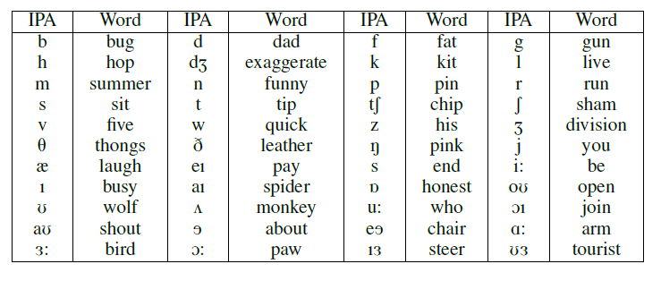

# POCO: Pop noise corpus

## Table of contents 

* [Introduction](#introduction)
* [Target phenomenon in the dataset](#target-phenomenon-in-the-dataset)
* [Outlines](#outlines)
* [List of pronounced words](#list-of-pronounced-words)
* [Participants](#participants)
* [Recording condition](#recoding-condition)
* [Postprocessing](#postprocessing)
* [Data format](#data-format)
* [Download](#download)


## Introduction 

 

Recently, various approaches to liveness detection have been proposed to improve robustness of automatic speaker verification (ASV) against spoofing attacks. Pop-noise detection [1] is a liveness detection approach which utilizes *pop-noise*, which is a distinctive noise which occures when speaker’s breath reaches a microphone. One of the benefits of pop noise detection is its simplicity, i.e. build-in microphones are in principle sufficient to receive pop noise, and there are a few papers focusing on pop noise detection [1,2,3,4]. 

 

To provide research communities with shared benchmark dataset of pop noise detection, we collected and published new dataset, POCO, which is first publicly available dataset focusing on pop noise.  

 

## Target phenomenon in the dataset 

 

In this dataset, we define pop noise as a specific signal generated by human breath, which cannot be explained by vibrations of vocal folds and vibrations of air inside the vocal tract. While pulsive noise with clipping is the most clear example of pop noise, such phenomenon is easily affected by volume of speaker’s voice or gain of signal recording. Thus, we focused on the broader definition of pop noise as is described above, and tuned microphone gain during recordings to reduce effect of speaker’s volume and clipping. 

 

## Outlines 

 

We conducted recordings with three different recording settings, RC-A, RP-A, and RC-B, as outlined in the following table. Here, the `distance` column shows the distance between speaker’s mouth and a microphone. 

 

| Setting | Recording device | distance |
|---|---|---|
| RC-A | Audio-technica AT4040 microphone | 10cm | 
| RP-A | Audio-technica AT4040 microphone w/ pop filter (TASCAM TM-AG1) | 10cm | 
| RC-B | 15 x audio-techinca AT9903 microphones (microphone array) | 5cm, 10cm, 20cm | 

In the first setting, RC-A, we used high-quality condenser microphone, audio-technica AT4040 microphone, to record voice. This subset of data represents high-quality voice recordings with the effect of pop noise. 

 

In the second setting, RP-A, we introduced a pop filter between the speaker's mouth and the microphone in order to enable comparison between audio signal w/ and w/o pop noise. We used the same microphone as used in RC-A setting. This subset of data represents high-quality voice recordings without the effect of pop noise. 

 

In the last setting, RC-B, we used a microphone array which consists of 15 audio-technica AT9903 microphones to record voice. Also we conducted recordings at three different distance between the speaker’s mouth and the microphone array. The purpose of introducing this setting is to investigate how the effect of speaker’s breath changes depending on the relative position of the microphone (distance and angle) to speaker’s mouth. 

 

## List of pronounced words 

 

It is expected that the effect of speaker’s breath, i.e. pop noise, depends on a pronounced word. Thus, to obtain diverse set of pronunciations in the dataset, we asked each subject to speak the words listed in the following table, which cover all 44 phonemes in English. 



## Participants 

 

We recruited 66 subjects (34 female and 32 male) to perform the recordings. They have various levels of English fluency and speak different accents. The subjects’ age ranges from 18 to 61. 

Gender of each participants are listed in `data.csv`. 

## Recording condition 

### Environment 

Specification of the audio room used for the recording was described below. Measured noises level were 18.6 dB(A) and 51.7 dB(F). 

* Internal room size [mm]：5418(W) × 5650(D) ×　3225(H) 

* Reverberant time：0.35 [s] 

* Sound insulation performance：31.2 dB or higher (63Hz or higher) 

 

### Devices 

 

Audio devices used for recording are as follows: 

* Microphone: Audio-technica AT5050, Audio-technica AT9903 
* Recording device: ZOOM F8 
* Pop gard: TASCAM TM-AG1 

 

The dimensions of the microphone array used in RC-B setting are shown in the following figure. The microphone array consists of 15 Audio-techinica AT9903 microphones without windscreen. Each microphone in the array has a unique ID (1-15) as shown in the figure. Microphone 7 is positioned in front of a speaker's mouth during recordings.


### Recording procedure 

 

For each of five recording setting (RC-A, RP-A, RC-B (5cm), RC-B (10cm), and RC-B(20cm)), we repeated recordings for three sessions. All 44 words are pronounced in every session. To reduce bias from word ordering, we randomize the word ordering for each session. 

 

Since the volume of speaker’s voice varies depending on recording settings, we tuned gain of signal recording before recordings of each setting. In RC-B setting, we tuned all microphones in the array independently. During the tuning, we asked each subject to pronounce all 44 words, and we tuned gain so that maximum volume did not exceed a predefined threshold (-6dB). 

> This tuning, however, introduces different level of noise in recordings of different settings. One should be careful and take this into account when conducting experiments on this dataset.

During recordings, we asked subject to direct their mouth to the center of a microphone (or Microphone 7 of the microphone array). 

 

Recordings are conducted with sample rate of 48kHz, and bit-depth of 24 bit. 

 

 

## Postprocessing 

### Splitting audio files for each word 

 

We recorded all utterances of 44 words in a single connected audio file. In postprocessing, we used [DeepSpeech](https://github.com/mozilla/DeepSpeech), a speech-to-text engine, to split this single audio file into a set of 44 audio files each of which contain a single word as follows. 

 

Apply DeepSpeech engine to each audio file and extract pronounced words and their start/end time. 

If the number of extracted words is not 44, ground-truth number of words, we manually check the audio file to extract all 44 words correctly. 

For each word utterance, we split frames based on their start/end time with a margin of 0.5 seconds, i.e. frames in [start_time – 0.5, end_time + 0.5]. 

 

#### Synchronization of audio files in RC-B subset 

 

In RC-B setting, recordings of 15 microphones are not completely synchronized. This is because we used two F8 Zoom Multitrack Field Recorders in our recording, and it is difficult to completely synchronize audio files recorded by different recorder. Only audio files recorded by the same recorder are guaranteed to be synchronized, i.e. they are split at completely same time frame. The correspondence between microphones and a recorder is as follows: 

* Recorder 1: Microphone 1-8 
* Recorder 2: Microphone 9-15 

### Manual inspection 

The processed audio samples relying solely on the API inevitably contained noises such as the noises of coughing and sneezing. Thus, at the last step of audio post-processing, we listened to and tuned manually all collected samples to discard such unwanted samples.

Since the RC-B recordings of the microphone array were performed simultaneously, we inspected only one of the microphones’ recording.

> Due to its large size, we may overlook some errors or noises. If you find any errors, please tell us via e-mail ([e-mail addresses](#contact)).

## Data format 
### Audio files

Our dataset contains 403,137 audio files. Each audio file contains one utterance of a word in WAV format. The sample rate is 22.05 kHz, and bit depth is 16 bit. 

Filename and directory of each audio file follows the following conventions: 

   recordings of RP-A and RC-A : `{subject_ID}-{setting_ID}-{repeat}/{word}.WAV`

recordings of RC-B : `{subject_ID}-{setting_ID}-{repeat}/{microphone_ID}-{word}.WAV`

 

Here, meanings of each placeholders are as follows: 

 

* `{subject_ID}` - a unique ID for each speaker 

* `{setting_ID}` - a unique ID for each recording setting (see the following table) 

* `{repeat}` - repeat count of each recording (1, 2, or 3. We repeat each recording setting three times.) 

* `{microphone_ID}` - a unique ID of a microphone in the microphonearray (see the above figure of the microphone array) 

* `{word}` - a word pronounced in each audio file 

 
| setting ID | description |
| --- | --- |
| 1 | RP-A |
| 2 | RC-A |
| 3 | RC-B (5 cm) |
| 4 | RC-B (10 cm) |
| 5 | RC-B (20 cm) |

 
> **Note:**
> * Due to human error, there are 783 missing utterances as listed in `lost.csv`.
> * We conducted one redundant session, `0221_3-3-4`, by error.

### Other files

There are two additional files in the dataset:

* `data.csv`: Gender of each participants.
* `lost.csv`: List of missing audio filenames.


## Download 

 

You can download POCO dataset from this [release](https://github.com/aurtg/poco/releases/tag/0.0). The file is encrypted by a password. To get the password, please send us an email with your name and affiliation ([Email addresses](#contact)). This procedure is necessary for administrative procedures related to the protection of the subject’s privacy. **You can use this dataset for research purpose only. Do not redistribute audio data of this dataset without our permission.** 

 

You can decrypt and decompress dataset using 7-Zip as follows (it may take a few hour): 

 

``` 

7z x –p<Password> -mem=AES256 POCO.zip 

``` 

## Contact

If you have any question, please feel free to send an e-mail to the following authors.

* Kosuke Akimoto: kosuke_a@nec.com
* Sakiko Mishima: s.mishima@nec.com
* Ryo Mizushima: r-mizushima@nec.com

## Paper

If you use this dataset in your work, please cite our paper:

```
@inproceedings{akimoto2020poco,
  title={POCO: a Voice Spoofing and Liveness Detection Corpus based on Pop Noise},
  author={Akimoto, Kosuke and Liew, Seng Pei and Mishima, Sakiko and Mizushima, Ryo and Lee, Kong Aik},
  booktitle={INTERSPEECH 2020},
  year={2020},
  organization={International Speech Communication Association (ISCA)}
}
```

## References  

[1] S.  Shiota,  F.  Villavicencio,  J.  Yamagishi,  N.  Ono,  I.  Echizen,and   T.   Matsui,   “Voice   liveness   detection   algorithms   basedon  pop  noise  caused  by  human  breath  for  automatic  speakerverification,” inINTERSPEECH 2015, 16th Annual Conference ofthe  International  Speech  Communication  Association,  Dresden,Germany,   September   6-10,   2015.ISCA,   2015,   pp.   239–243.  [Online].  Available:http://www.isca-speech.org/archive/interspeech2015/i150239.html 

[2] S.  Shiota,  F.  Villavicencio,  J.  Yamagishi,  N.  Ono,  I.  Echizen,and T. Matsui, “Voice liveness detection for speaker verificationbased  on  a  tandem  single/double-channel  pop  noise  detector,”inOdyssey  2016:The  Speaker  and  Language  RecognitionWorkshop,  Bilbao,  Spain,  June  21-24,  2016,  L.  J.  Rodr ́ıguez-Fuentes and E. Lleida, Eds.    ISCA, 2016, pp. 259–263. [Online].Available: https://doi.org/10.21437/Odyssey.2016-37 

[3] S. Mochizuki, S. Shiota, and H. Kiya, “Voice liveness detectionusing phoneme-based pop-noise detector for speaker verification,”inOdyssey  2018:The  Speaker  and  Language  RecognitionWorkshop,   26-29  June  2018,   Les  Sables  d’Olonne,   France,A.  Larcher  and  J.  Bonastre,  Eds.ISCA,  2018,  pp.  233–239.[Online]. Available: https://doi.org/10.21437/Odyssey.2018-33 

[4] Q.  Wang,  X.  Lin,  M.  Zhou,  Y.  Chen,  C.  Wang,  Q.  Li,  andX. Luo, “Voicepop:  A pop noise based anti-spoofing system forvoice authentication on smartphones,” in2019 IEEE Conferenceon Computer Communications, INFOCOM 2019, Paris, France,April 29 - May 2, 2019.IEEE, 2019, pp. 2062–2070. [Online].Available: https://doi.org/10.1109/INFOCOM.2019.8737422 
